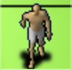

# legacy-lua-25d
##### _G-Town_

## About
**G-Town** is a daft, low-fi **pseudo-3D (2.5D)** open-world driving toy, built with Lua and
[LOVE2D](https://love2d.org). The city is generated from **real OpenStreetMap data** -- actual street
grid, building footprints and heights -- rendered with a rotating camera and a hand-rolled perspective
projection (extruded building boxes, depth sort; no z-buffer, all 2D draw calls).

## Features
- A real city centre generated from OpenStreetMap
- Full camera rotation, heading-up movement
- Buildings extruded from real heights (tall/short mix), depth-sorted
- Oblique pseudo-3D view with a low-fi retro aesthetic
- Driveable vehicles (cars, sedans, bikes) with weight-based collision
- AI traffic following road networks with junction navigation
- Pedestrian NPCs walking pavements with animated sprites
- Melee combat with health bars and aggro system
- Web build via love.js (WASM)

### Links

    
     
    <strong>Play:</strong>
     
    
    
     
    <strong>Source Code:</strong>
     
    
     
    

## Running locally

    npm run setup      # install npm deps + download LOVE 11.5
    npm start          # launch the game

Controls: **W/S** move, **A/D** turn, **Shift** sprint, **E** enter/exit vehicle, **F** attack.

### Regenerate the map

    node scripts/fetch-map.js   # re-fetch city geometry from OpenStreetMap (Overpass)

### Web build

    npm run build      # pack src/ into .love, compile to Web/ via love.js
    npm run serve      # serve Web/ at http://localhost:8080

## Attribution

Map geometry from [OpenStreetMap](https://www.openstreetmap.org/copyright) contributors (ODbL).

## License

MIT License. See `LICENSE` file for details.
